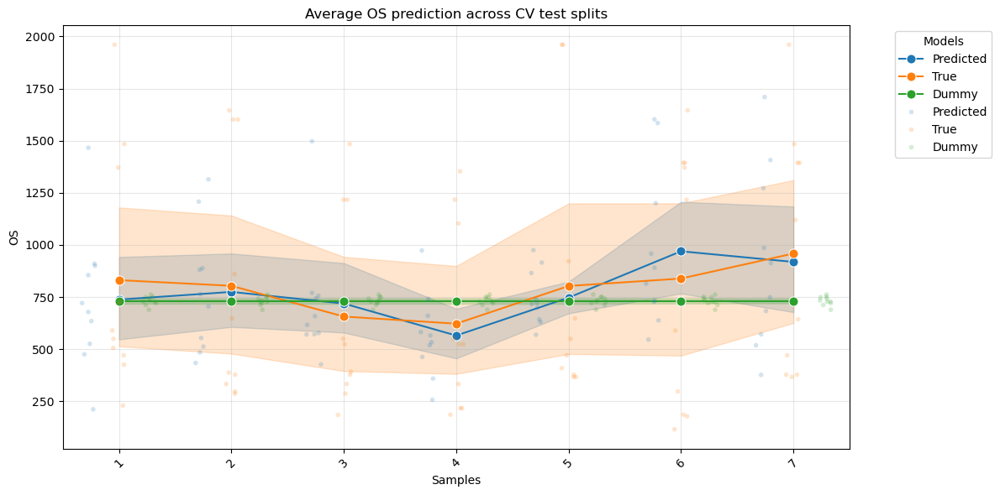

# Team Gliomatrix submission for [Owkin | Servier GBM Hackathon 2025](https://www.owkin.com/connect/glioblastoma-ai-hackathon)

## Team Members

- Pawan Kumar
- Sarah Dandou
- Kimia
- Naomie
- Arun
- Alex
- Yannick
- [Himanshu](https://github.com/man-shu)

## Project details

You can find the presentation slides in the `presentation` directory.

We decided to predict the survival of patients (in days) with glioblastoma
after the first diagnosis. We used the MOSAIC dataset provided by
Owkin and Servier.

To summarize, given the multi-modal nature of the MOSAIC dataset we proposed
a stacked model that combines predictions from several models each trained on
a different modality. The code for this implementation is in the
`prediction_pipelines.ipynb` notebook.

The following figure summarizes our approach:

## Results

Our model achieved an average concordance index of 0.68 over 10
cross-validation folds. We compared our model with a dummy regressor that
predicts the mean of survival time from the training set.

The following figure provides a better look at the performance of our model
compared to the dummy regressor as well as the actual survival times.

## Depends on

- <https://github.com/owkin/gbm_hackathon>
- and the MOSAIC data from Owkin which is closed source
